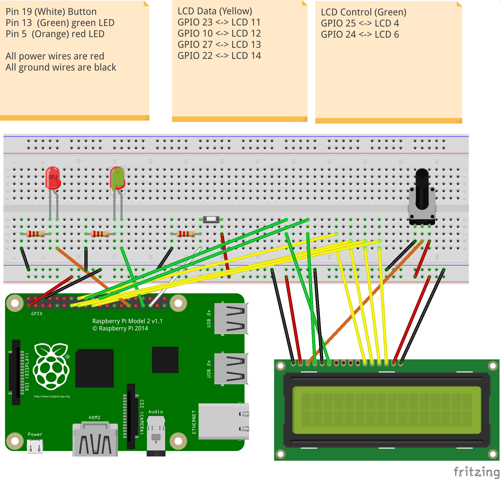

# f28hs-2021-22-cwk2-sys

## Contents

This folder contains the following files for the source code:
- `master-mind.c` ... the main C program for the CW implementation, and most aux fcts
- `mm-matches.s`  ... the matching function, implemented in ARM Assembler
- `lcdBinary.c`   ... the low-level code for hardware interaction with LED, and button;
                      this should be implemented in inline Assembler; 
- `testm.c`       ... a testing function to test C vs Assembler implementations of the matching function
- `test.sh`       ... a script for unit testing the matching function, using the -u option of the main prg

## Wiring

An **green LED**, as output device, should be connected to the RPi2 using **GPIO pin 13.**

A **red LED**, as output device, should be connected to the RPi2 using **GPIO pin 5.**

A **Button**, as input device, should be connected to the RPi2 using **GPIO pin 19.**

You will need resistors to control the current to the LED and from the Button.

The Fritzing diagram below visualises this wiring. 

